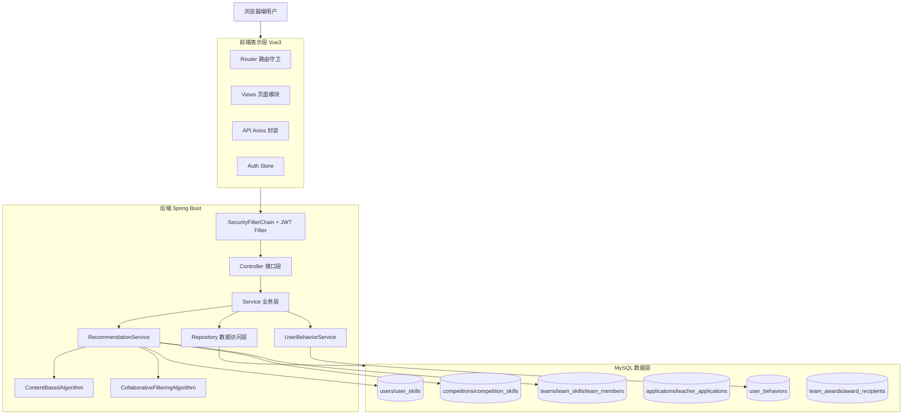

# 系统结构说明

## 1. 系统总体结构

本项目当前实现为前后端分离架构，具体为：

- 前端：`frontend`（Vue 3 + Vite + TypeScript + Element Plus + Pinia + Vue Router + Axios）。
- 后端：`backend`（Spring Boot 2.7 + Spring Security + Spring Data JPA）。
- 数据库：MySQL 8（`schema_v3.sql` 定义核心表结构）。
- 鉴权与权限控制：JWT + Security 过滤链；接口以“认证必需 + 业务层角色校验”组合实现。
- 推荐模块位置：后端 `algorithm` + `RecommendationService`，通过 `CompetitionService` 嵌入竞赛域接口。

结合代码位置说明：

- 后端入口：`backend/src/main/java/com/competition/CompetitionPlatformApplication.java`。
- 前端入口：`frontend/src/main.ts`，路由主入口在 `frontend/src/router/index.ts`。
- 鉴权核心：`SecurityConfig`、`JwtAuthenticationFilter`、`JwtUtils`。
- 推荐核心：`ContentBasedAlgorithm`、`CollaborativeFilteringAlgorithm`、`RecommendationService`、`UserBehaviorService`。

## 2. 分层结构说明

### 2.1 表现层（前端 UI 层）

- 主要技术：Vue 3、Element Plus、Vue Router、Pinia。
- 目录位置：`frontend/src/views`、`frontend/src/layouts`、`frontend/src/components`。
- 主要职责：页面展示、用户交互、角色化导航、参数组装与结果渲染。

### 2.2 接口接入层（前端 API 层）

- 主要技术：Axios 封装。
- 目录位置：`frontend/src/api`、`frontend/src/stores/auth.ts`。
- 主要职责：统一调用后端 REST 接口、附加 Token、处理登录失效跳转。

### 2.3 后端接口层（Controller 层）

- 主要技术：Spring MVC 注解式控制器。
- 目录位置：`backend/src/main/java/com/competition/controller`。
- 主要职责：参数接收与校验、用户身份提取、调用业务服务、返回 DTO。

### 2.4 业务逻辑层（Service 层）

- 主要技术：Spring Service + 事务控制。
- 目录位置：`backend/src/main/java/com/competition/service`。
- 主要职责：执行业务规则、角色权限判定、跨实体流程编排、推荐计算与行为写入。

### 2.5 数据访问层（Repository 层）

- 主要技术：Spring Data JPA。
- 目录位置：`backend/src/main/java/com/competition/repository`。
- 主要职责：实体持久化、分页查询、业务条件查询、批量更新。

### 2.6 数据存储层（MySQL 层）

- 主要技术：MySQL 8。
- 结构来源：`backend/src/main/resources/sql/schema_v3.sql`。
- 主要职责：承载用户、竞赛、队伍、申请、技能、行为、奖项等核心数据。

## 3. 系统业务链路说明

### 3.1 学生链路：浏览竞赛 -> 报名申请 -> 入队/协作

1. 学生在竞赛列表查看竞赛，可选择推荐模式（`recommend=true`）。
2. 进入竞赛详情时，系统尝试写入 `VIEW` 行为（学生、已登录场景）。
3. 学生在竞赛报名页查看推荐队伍并提交申请。
4. 申请成功后写入 `APPLY` 行为，进入教师审核链路。
5. 审核通过后生成队伍成员关系，学生进入队伍协作（讨论/提交）。

### 3.2 教师链路：申请带队 -> 管理队伍 -> 审核学生

1. 教师在竞赛详情提交教师申请（含技能方向）。
2. 管理员审核通过后，系统自动生成该教师在该竞赛下的队伍并同步队伍技能。
3. 教师在队伍管理页查看申请、审核学生入队。
4. 教师可关闭招募、管理成员、参与队伍讨论与成果提交。

### 3.3 管理员链路：治理与结果发布

1. 管理员发布/更新竞赛信息，维护竞赛生命周期。
2. 管理员审核教师申请，控制带队资格与队伍生成。
3. 管理员可解散异常队伍。
4. 竞赛结束且队伍关闭后，管理员发布奖项并生成获奖成员快照。

### 3.4 推荐链路：画像/行为 -> 评分 -> 结果返回

1. 读取用户技能画像与候选竞赛技能需求，计算内容相似度。
2. 读取行为表构建协同过滤评分（行为不足时跳过）。
3. 按 `alpha=0.8` 混合评分并排序，返回 `matchScore` 与推荐理由。
4. 若不可推荐或协同过滤不可用，回退到默认列表或内容排序。

## 4. 文字版功能结构图

```text
学科竞赛管理平台
├─ 学生端
│  ├─ 登录与个人信息
│  ├─ 竞赛浏览与推荐
│  ├─ 竞赛报名申请
│  ├─ 我的申请
│  ├─ 我的队伍
│  ├─ 队伍协作（讨论/提交/成员）
│  ├─ 技能维护
│  └─ 荣誉查看
├─ 教师端
│  ├─ 竞赛浏览
│  ├─ 提交教师申请
│  ├─ 我的教师申请
│  ├─ 队伍查询与详情管理
│  ├─ 学生申请审核
│  └─ 队伍协作（讨论/提交/成员）
├─ 管理员端
│  ├─ 竞赛发布与更新
│  ├─ 教师申请审核
│  ├─ 队伍查询与解散
│  ├─ 奖项发布与记录查询
│  └─ 技能字典管理
└─ 推荐模块
   ├─ 竞赛推荐（内容+协同过滤+混合）
   ├─ 队伍推荐（技能匹配）
   ├─ 推荐理由生成
   └─ 回退机制（fallback）
```

## 5. 文字版系统架构图



## 6. 推荐模块位置与依赖关系专项说明

### 6.1 推荐逻辑所在类/模块

- 入口控制：`CompetitionController`。
- 业务编排：`CompetitionService`。
- 推荐服务：`RecommendationService`。
- 算法实现：`algorithm/ContentBasedAlgorithm`、`algorithm/CollaborativeFilteringAlgorithm`。
- 行为写入：`UserBehaviorService`。

### 6.2 依赖数据表

- 竞赛推荐主要依赖：`user_skills`、`competition_skills`、`user_behaviors`。
- 队伍推荐主要依赖：`user_skills`、`team_skills`（并结合队伍状态）。
- 推荐结果展示涉及：`competitions`、`teams`。

### 6.3 与 competitions、teams、user_behaviors、skills 的关系

- `competitions`：推荐输出主体之一，竞赛列表接口承载推荐结果。
- `teams`：队伍推荐输出主体，按竞赛内招募队伍进行排序返回。
- `user_behaviors`：协同过滤核心输入；当前真实写入来源为 `VIEW` 与 `APPLY`。
- `skills`：通过 `user_skills`、`competition_skills`、`team_skills`形成内容推荐向量基础。

### 6.4 独立模块还是嵌入业务模块

- 当前实现并非独立“推荐微服务”，而是嵌入竞赛业务模块。
- 历史 `/api/recommendations` 已弃用，代码中保留占位/注释文件。

### 6.5 fallback 在链路中的位置

- 入口前回退：未登录或无技能 -> 不启用推荐排序。
- 混合阶段回退：行为不足或协同过滤无结果 -> 内容推荐兜底。
- 输出阶段回退：结果为空 -> 返回默认列表；队伍推荐中会返回 `fallbackSorted=true` 标记。

## 7. 第四章可直接使用的设计要点摘要

### 7.1 对应 4.1 系统总体架构设计

- 系统采用前后端分离架构，前端负责交互与角色化入口，后端负责业务编排与权限控制。
- 后端以 Controller-Service-Repository 分层实现业务，数据库采用关系模型支撑主流程。
- JWT 鉴权与角色权限控制贯穿全链路，支持三角色并行业务处理。
- 推荐能力以内嵌方式接入核心业务接口，避免独立系统间同步复杂度。

### 7.2 对应 4.2 功能模块设计

- 功能模块围绕“竞赛管理、队伍协作、申请审核、奖项荣誉、技能维护”构建完整业务闭环。
- 学生、教师、管理员角色在页面入口和业务服务层形成双重边界控制。
- 教师申请与学生申请分别构成“带队准入”和“入队准入”两条关键审批链路。
- 队伍讨论与提交能力补齐参赛过程协作场景，使系统不止停留在报名管理层面。

### 7.3 对应 4.4 推荐模块设计

- 推荐模块采用内容推荐与协同过滤混合策略，使用固定 `alpha` 进行线性融合。
- 内容侧基于技能向量匹配，行为侧基于用户历史行为权重聚合，兼顾可解释性与个性化。
- 系统通过 `VIEW/APPLY` 行为自动沉淀推荐输入，形成持续演化的数据闭环。
- 在冷启动和稀疏场景下引入 fallback 机制，保障推荐链路稳定可用。

## 8. 历史遗留/已废弃/未启用说明

### 8.1 后端侧

- `/api/recommendations`：已废弃，`RecommendationController` 仅占位。
- `RecommendationResult` DTO：标记为 deprecated。

### 8.2 前端侧

- `src/api/recommendations.ts`：仅保留废弃注释，未实际调用。
- `src/views/recommendations/CompetitionRecommendations.vue`：标记废弃，未路由挂载。
- `src/pinia/stores/permission.ts`：文件头标注 deprecated，当前布局路由未使用。
- `src/views/me/Skills.vue.bak`：备份文件，未启用。
- `src/views/admin/AdminTeacherApplications.vue`、`src/views/teacher/TeacherApplyList.vue`、`src/views/teacher/TeacherApplyCreate.vue`、`src/views/teams/JoinTeam.vue`：存在实现但未在当前路由中启用。

### 8.3 文档层

- 根目录 `README.md` 中前端技术栈仍写为 React/Ant Design，与当前实际 Vue3 实现不一致，属于历史描述未更新。

